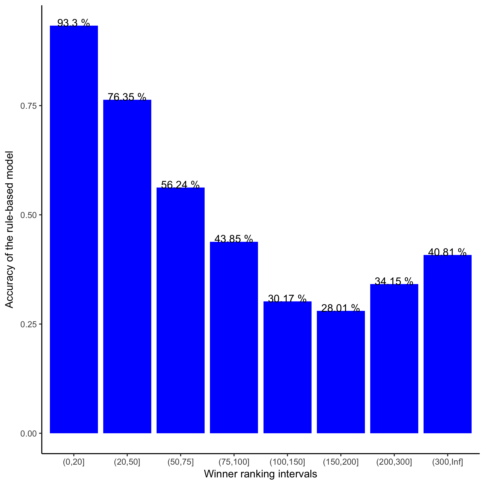

```{r setup}
knitr::opts_knit$set(root.dir = normalizePath("../.."))
```


# Introduction

We just wanna know the performance of simple rule-based model that uses the ranks of the players only to predict the winner of a given match.


```{r import_data, echo = TRUE, include = FALSE}
library(data.table)
library(tidyverse)
data <- fread(input = "Data/Raw/data_game_by_game.csv")
data <- data[-which(is.na(data$winner_rank) | is.na(data$loser_rank)),]
```

```{r transform_data, include = FALSE}
data <- data %>% 
          mutate(
            rule_based_prediction = ifelse(winner_rank < loser_rank, 1, 0)
          )
```

# Results

The accuracy of this simple model is equal to **`r paste(round(100 * mean(data$rule_based_prediction), 2), "%")`** for the entire dataset.

If we build buckets based on the winner rank and calculate the accuracy, we obtain interesting results.

```{r accuracy_buckets}
library(ggplot2)
library(ggthemes)
ranking_buckets <- c(0, 20, 50, 75, 100, 150, 200, 300, Inf)
data_buckets <- data %>% 
                  mutate(
                    rank_bucketed = cut(winner_rank, ranking_buckets)
                  ) %>% 
                  group_by(
                    rank_bucketed
                  ) %>% 
                  summarise(
                    accuracy = mean(rule_based_prediction)
                  )
p <- ggplot(data_buckets, aes(x = rank_bucketed, y = accuracy, label = paste(round(100 * accuracy, 2), "%"))) +
  geom_bar(stat = "identity", fill = "blue") +
  scale_x_discrete("Winner ranking intervals") +
  scale_y_continuous("Accuracy of the rule-based model") +
  geom_text(vjust = 0.1) +
  theme_classic()
ggsave(filename = "Modeling/RuleBased/images/rank_bucketed.png", plot = p)
```


